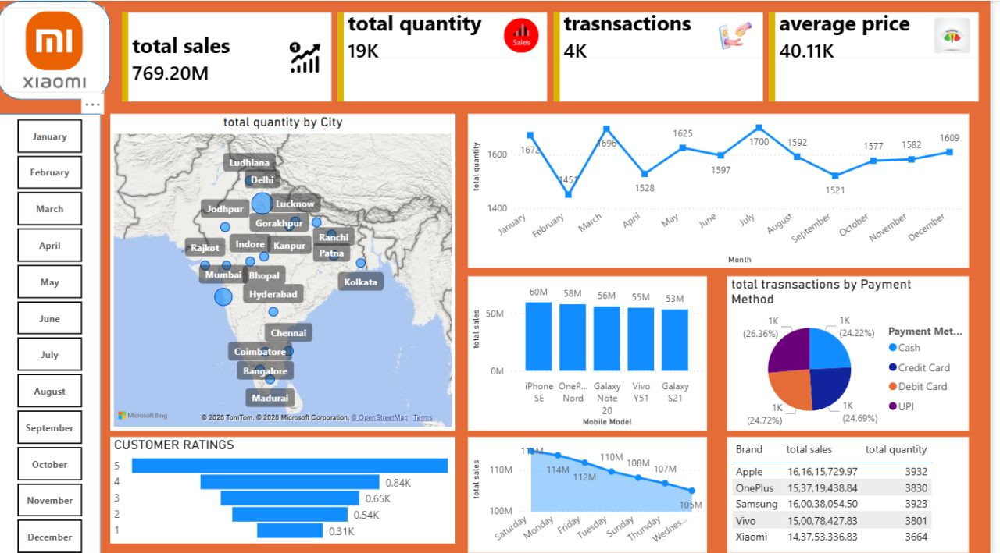

# projects-1
my sql and power bi projects 


## 💻 SQL Case Study: Hospital & Pharmaceutical Sales Analysis
**File:** `sql project....sql`

This project features a comprehensive script analyzing pharmaceutical sales datasets across metrics like cities, therapeutic areas, sales representatives, and financial metrics.

### 🔹 Core Technical Competencies Demonstrated:
*   **Window Functions & Partitioning:** Utilized `RANK() OVER (PARTITION BY ...)` to determine top sales reps within localized geographic territories and specialized therapeutic areas.
*   **Time-Series & Trend Analysis:** Implemented `LAG()` over monthly date fields to calculate **Month-over-Month (MoM) revenue growth percentages** and running totals.
*   **Conditional Segmenting:** Wrote robust `CASE WHEN` logical expressions to categorize business metrics by transaction discount values and high/medium/low financial revenue brackets.
*   **Advanced Filtering:** Leveraged `HAVING` clauses alongside structural multi-table **Common Table Expressions (CTEs)** to filter aggregate data fields dynamically.

### 🔍 Featured SQL Architecture Snippet

Here is an example from my script calculating **Month-over-Month Growth** using an advanced CTE and nested window functions:

```sql
WITH month_o_month AS (
    SELECT 
        TO_CHAR(order_date, 'mon') AS order_month,
        EXTRACT(MONTH FROM order_date) AS month_num,
        SUM(revenue) AS current_month_revenue
    FROM hospital
    GROUP BY TO_CHAR(order_date, 'mon'), EXTRACT(MONTH FROM order_date)
)
SELECT 
    order_month,
    current_month_revenue,
    LAG(current_month_revenue) OVER (ORDER BY month_num) AS previous_month_revenue,
    ((current_month_revenue - LAG(current_month_revenue) OVER (ORDER BY month_num)) / 
      LAG(current_month_revenue) OVER (ORDER BY month_num)) * 100 AS mom_growth
FROM month_o_month
ORDER BY month_num;
```

---

# 📊 Sales & Financial Transaction Analytics Dashboards

An interactive data analytics project featuring two distinct interactive business intelligence dashboards. These dashboards analyze retail sales performance and digital payment transaction behaviors across India, transforming raw operational data into actionable strategic insights.

## 📈 Dashboard 1: Xiaomi Retail Sales Performance
A comprehensive retail sales tracking dashboard designed to monitor revenue streams, product demand, and regional market penetration.

*   **Key Metrics Tracked:** Total Sales (769.20M), Total Quantity Sold (19K), Total Transactions (4K), and Average Order Value (40.11K).
*   **Core Visualizations:**
    *   **Geospatial Analysis:** Mapping product distribution and quantity across major Indian cities (Delhi, Mumbai, Bengaluru, etc.).
    *   **Time-Series Trends:** A monthly sales trajectory line chart identifying peak seasonal demand.
    *   **Product Insights:** Top-performing mobile models (iPhone SE, OnePlus Nord, Galaxy Note 20) against brand-level financial breakdowns.
    *   **Customer Feedback:** Breakdown of star ratings to monitor customer satisfaction levels.

## 📱 Dashboard 2: PhonePe Financial Transactions Analytics
A deep dive into digital wallet transaction metrics, user behavior, and regional financial trends across India's premier payments network.

*   **Key Metrics Tracked:** Average Transaction Value (278.08), Month-over-Month (MoM) Growth (8.31%), Total Transaction Volume (1.39M), and Total Unique Transaction Counts (5K).
*   **Core Visualizations:**
    *   **Payment & Category Breakdown:** Micro-analysis of transaction volumes segmented by mode (UPI, Credit/Debit card) and utility categories (Education, Shopping, Travel).
    *   **Regional Dominance:** State and city-level monetary aggregations (highlighting key areas like Lucknow, Kanpur, and Hyderabad).
    *   **Transaction Types:** Distribution comparison between Merchant Payments, P2P Transfers, Bill Payments, and Mobile Recharges.
    *   

## 💡 Key Business Insights Derived
1. **Product Demand:** Premium and mid-range smartphones (Apple/OnePlus) drive the highest chunk of gross sales value despite lower unit volumes compared to entry-level models.
2. **Payment Evolution:** UPI and digital wallets continue to dominate transaction counts, while high-value transactions still rely heavily on credit cards and bank transfers.
3. **Regional Hotspots:** Tier-1 and Tier-2 hubs like Hyderabad, Kanpur, and Lucknow represent the highest transactional density for digital payments.
----

## 🛠️ Tech Stack & Skills Used
*   **Languages:** SQL (PostgreSQL/SQL Server syntax)
*   **Tools:** Power BI Desktop, Power Query, DAX
*   **Analytical Frameworks:** Cohort Segmentation, Time-Series Analysis, Financial KPI Auditing, Pareto-Style Mix Testing

## Project Showcases

<p>
  
  
</p>


